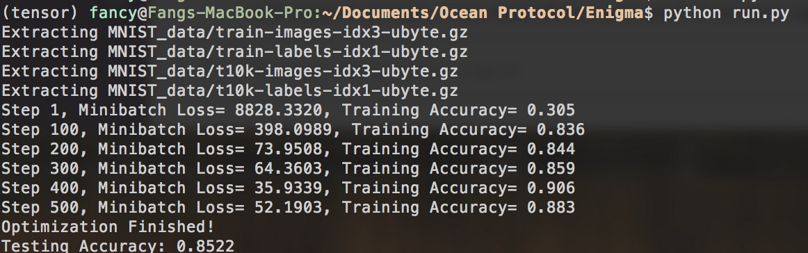

# tensorflow_AI_example

## 1.Objective
These are training data and python source file which demos a simple AI algorithm with neural network to recognize the hand-writing numbers. 

## 2.Neural Network Architecture

This demo has a 2-hidden layers fully connected neural network.


## 3.Input data
This example is using MNIST handwritten digits. The dataset contains 60,000 examples for training and 10,000 examples for testing. The digits have been size-normalized and centered in a fixed-size image (28x28 pixels) with values from 0 to 1. For simplicity, each image has been flattened and converted to a 1-D numpy array of 784 features (28*28).

More info: http://yann.lecun.com/exdb/mnist/


## 4.Folder Structure

Folder | description | 
---| ---| 
MNIST_data |  input training data | 
img| images used in README file |
run.py | python source file |


## 5.Software Requirement

It requires following software installed. Please verfiy `import tensorflow as tf` works in python.

* python
* tensorflow

## 6.Command to Run
```
$ python run.py
```
Note that the exact number shall not be expected, but it shall show some reaonable accuracy.



